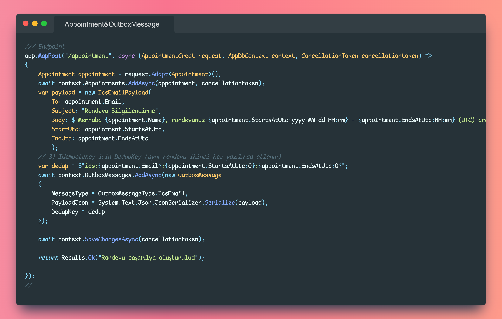
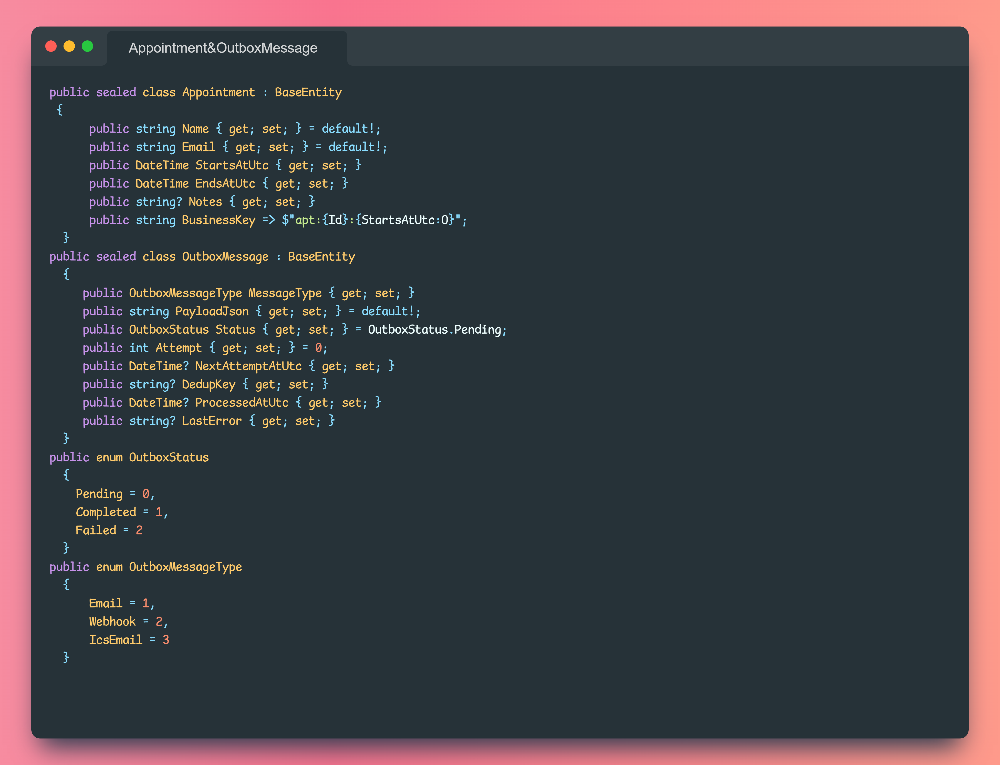

# 🗓️ Outbox Pattern ile Randevu & Takvim Daveti (.ics)

Bu proje, **Outbox Pattern** kullanarak randevu oluşturma senaryosunu güvenilir hale getirmeyi amaçlar.  
Klasik akışta randevu kaydı alındığında doğrudan e-posta gönderilir. Eğer o anda uygulama çökerse, e-posta kaybolur.  
Bu problem Outbox Pattern ile çözülür: mesaj önce **veritabanına kaydedilir**, ardından **BackgroundService** bu mesajı işleyerek **.ics takvim daveti** olarak SMTP üzerinden gönderir.

---

## 🚀 Özellikler

- **Tek transaction**: Appointment + OutboxMessage birlikte kaydedilir  
- **Retry + exponential backoff**: Geçici hatalarda otomatik tekrar denemeleri  
- **Idempotency**: Aynı olayın iki kez işlenmesi engellenir  
- **.ics takvim daveti**: Randevu bilgisini takvime eklenebilir formatta gönderir  
- **Pomelo MySQL + FluentEmail + SMTP4Dev** entegrasyonu  

---

## 🛠️ Kullanılan Teknolojiler

- [.NET 9](https://dotnet.microsoft.com/)  
- [Entity Framework Core](https://learn.microsoft.com/en-us/ef/core/)  
- [Pomelo.EntityFrameworkCore.MySql](https://github.com/PomeloFoundation/Pomelo.EntityFrameworkCore.MySql)  
- [FluentEmail](https://github.com/lukencode/FluentEmail)  
- [SMTP4Dev](https://github.com/rnwood/smtp4dev)  
- [Mapster](https://github.com/MapsterMapper/Mapster)  

---

## 📸 Ekran Görüntüleri

### Outbox Worker


### Appointment Endpoint


### Entity & Enum Yapısı


---

## ⚙️ Kurulum

### 1) Repoyu klonla
```bash
git clone https://github.com/BurakSekmenn/OutboxAppointmentDemo.git
cd OutboxAppointmentDemo
```

### 2) Docker ile MySQL ve SMTP4Dev ayağa kaldır
```bash
docker run -d --name mysql -e MYSQL_ROOT_PASSWORD=pass -e MYSQL_DATABASE=outbox_demo -p 3306:3306 mysql:8
docker run -d --name smtp4dev -p 3000:80 -p 25:25 rnwood/smtp4dev
```
- SMTP4Dev arayüzü: http://localhost:3000  
- SMTP portu: 25  

### 3) Migration ve DB güncelle
```bash
dotnet ef database update
```

### 4) Uygulamayı çalıştır
```bash
dotnet run --project src/OutboxPattern.WebAPI
```

### 5) Randevu isteği gönder
```http
POST http://localhost:5000/appointment
Content-Type: application/json

{
  "name": "Burak",
  "email": "test@example.com",
  "startsAtUtc": "2025-08-26T08:30:00Z",
  "endsAtUtc": "2025-08-26T09:00:00Z",
  "notes": "İlk muayene"
}
```

SMTP4Dev arayüzünde gelen `.ics` dosyası ekli maili görebilirsiniz ✅

---

## 📂 Proje Yapısı

```
src/
 ├── Configrution/
 │    └── AppointmentConfiguration.cs
 │    └── OutboxMessageConfiguration.cs
 ├── Context/
 │    └── AppDbContext.cs
 ├── Dtos/
 │    └── AppointmentCreat.cs
 │    └── IcsEmailPayload.cs
 ├── Enums/
 │    └── OutboxMessageType.cs
 │    └── OutboxStatus.cs
 ├── Models/
 │    └── Appointment.cs
 │    └── BaseEntity.cs
 │    └── OutboxMessage.cs
 ├── Services/
 │    └── AppointmentBackGroundService.cs
 ├── Program.cs
 └── ...
```

---

## 📚 Kaynaklar

- [Outbox Pattern – Microsoft Docs](https://learn.microsoft.com/en-us/azure/architecture/patterns/outbox)  
- [SMTP4Dev](https://github.com/rnwood/smtp4dev)

---


